## Customer Analytics and Uplift Testing

### Background: 
You are part of Quantium’s retail analytics team and have been approached by your client, the Category Manager for Chips, who wants to better understand the types of customers who purchase Chips and their purchasing behaviour.
The insights from your analysis will feed into the supermarket’s strategic plan for the chip category in the next half year.

### ERD:

## Executive Summary

## Customer Analytics
Defining metrics that'll help understand the customer segments and their purchasing behaviour:
Who spends the most on chips (total sales), describing customers by life stage and how premium their general purchasing behaviour is?
How many customers are in each segment?
How many chips are bought per customer by segment?
What’s the average chip price by customer segment?

#### Proportion of Contribution by different Life Stages in each Customer Segment
1. **Proportion of Sales by Life Stage and Customer Segment**
   
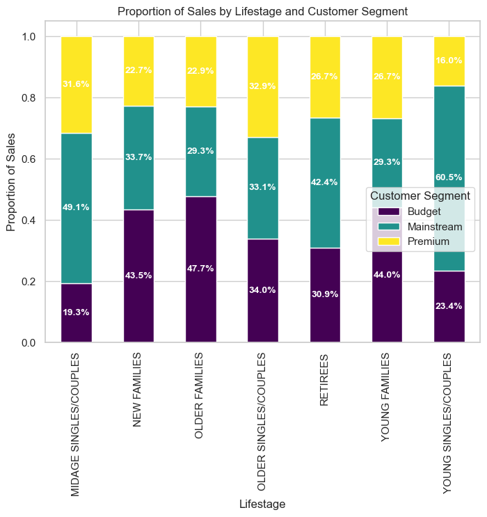
- **Mainstream Dominance Across Life Stages:**
    - The majority of sales come from Mainstream customers across all life stages, which aligns with the typical market behavior where mid-tier pricing attracts the broadest consumer base.
    - The highest proportion of Mainstream customers comes from Young Singles/Couples (60.5%).
    - Midage Singles/Couples (49.1%) follow, showing that middle-aged individuals continue to prefer mid-tier chip products.
- **Budget Segment: Older Consumers' Preference:**
    - Older Singles/Couples (47.7%) have the highest proportion in the Budget segment, followed by Young Families (44.0%).
- **Premium Segment is Niche, but Older Customers Show Interest:**
    - Premium segment sales are consistently lower across all life stages, implying that chips are not viewed as a premium-category product by most consumers.
    - However, Older Singles/Couples have the highest proportion in the Premium category (32.9%), suggesting that a niche group of older consumers prioritize premium chip brands, possibly due to perceived health benefits or brand loyalty.

2. **Proportion of Customer Count by Life Stage and Customer Segment**
   
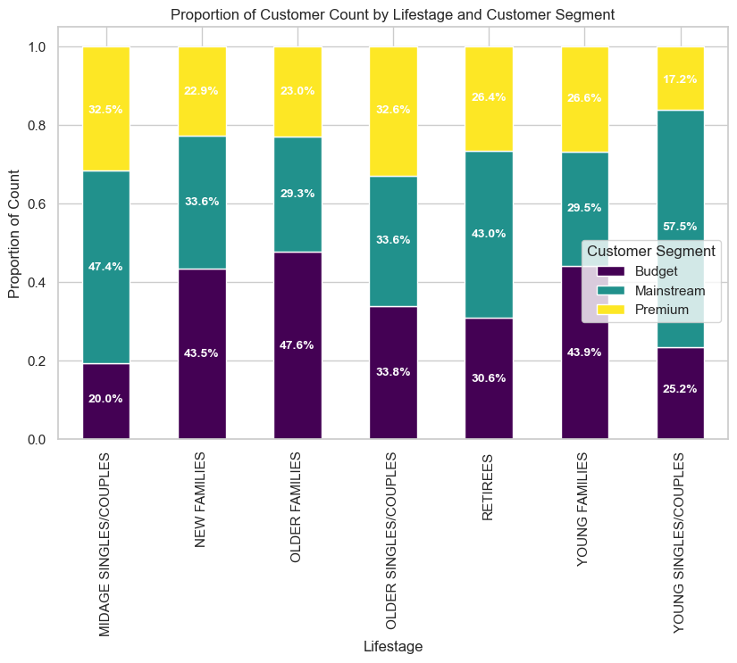
- **Mainstream Segment (Largest Count):**
    - The largest share of buyers comes from Young Singles/Couples (57.5%), followed by Mid-Age Singles/Couples (47.4%).
    - This aligns with the earlier sales distribution insights, reinforcing that younger individuals and middle-aged singles are key mainstream consumers.
- **Budget Segment (Strong Presence in Families):**
    - Older Families (47.6%) and New Families (43.5%) are heavily represented in the Budget segment.
    - This suggests that households with dependents prioritize affordability, possibly buying in bulk or opting for lower-cost alternatives.
- **Premium Segment (Higher Interest Among Older Consumers):**
    - Mid-Age Singles/Couples (32.5%) and Older Singles/Couples (32.6%) contribute significantly to the Premium segment.

While higher sales could be attributed to an increase in the number of customers, another possible driver is the number of unit price and units purchased per customer. 

#### Understanding Customer's Purchase Behaviour
1. **Average Purchase Volume per Customer**
   
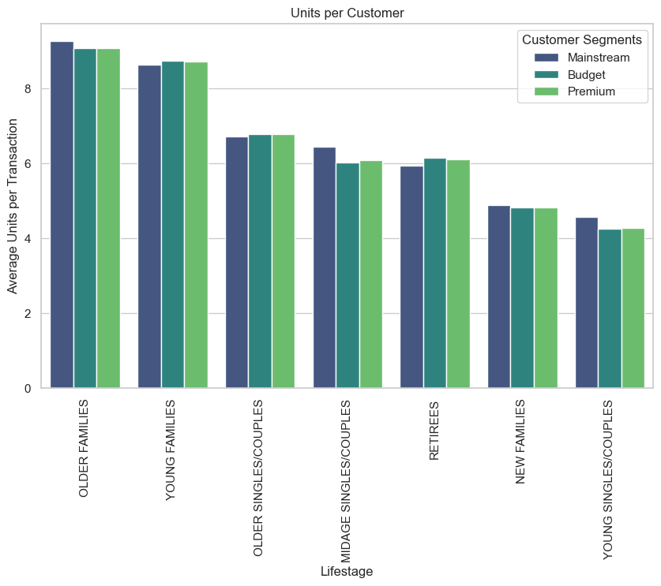
- **Older Families and Young Families buy a higher number of chips per transaction across all customer segments.** This suggests that families with children or larger household sizes tend to buy in larger quantities/bulk, possibly due to frequent consumption by more people in the household.
- **Mid-Age Singles/Couples and Young Singles/Couples purchase with the mainstream category buying slightly more than the counterparts.** Although the Young Singles/Couples purchase the least number of the chips per transaction. This may indicate that younger and mid-age individuals, especially in the budget and premium segments, have lower snack consumption, possibly due to health-conscious choices or budget constraints.
- **Older Single/Couples and Retirees show a balanced purchase pattern, with budget and premium segments slightly preferring more units per transaction.** This could imply a preference for quality over quantity or budget-conscious buying behavior.
- **New Families display a consistent trend across all segments,** suggesting that their purchasing habits are stable and do not vary significantly based on pricing categories.

2. **Average Unit Price per Customer**
   
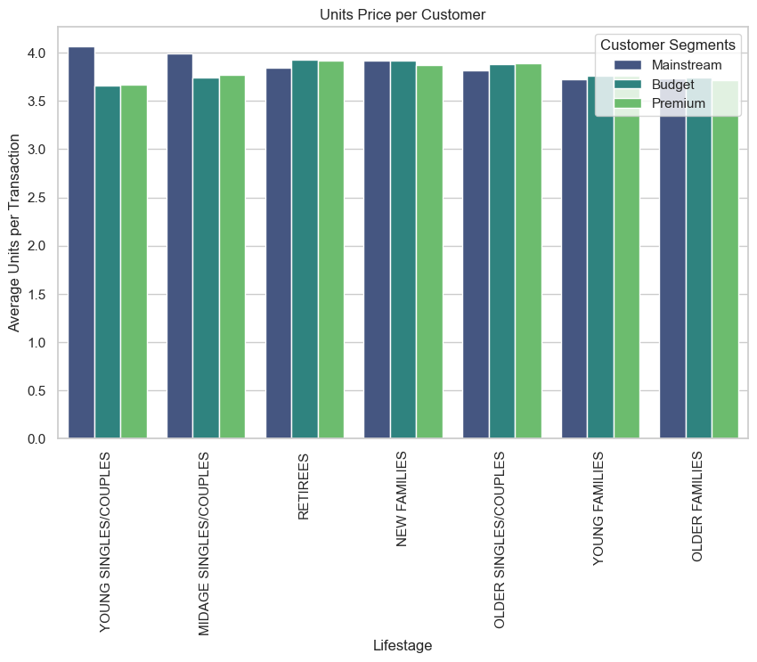
- Young Singles/Couples and Mid Age Singles/Couples in the Mainstream customer segment are more willing to pay more per pack compared to their Budget and Premium counterparts.
- Premium customers across all life stages have a lower unit price per transaction.
    - This could indicate that they either buy healthier alternatives (e.g., baked, organic, or gourmet snacks) which may not be included in the standard "chips" category or that they indulge in chips less frequently.
    - The trend is further supported by the observation that fewer Premium Young Singles/Couples and Mid-Age Singles/Couples purchase chips compared to their Mainstream counterparts.
- Retirees, Older Singles/Couples, and Families (Young, Older and New) exhibit consistent spending behavior across all customer segments.
    - This shows little price sensitivity for these customers.
    - However, the slight variations in pricing could indicate differences in pack sizes or preferred brands.

So far the indication is that customers in Young Singles/Couples and Mid Age Singles/Couples Lifestage of the Mainstream customer segment spend more on chips compared to other customer segments of the same life stage. 

### t-test
**Null Hypothesis(H₀):** The average price per unit paid by Mainstream customers is not significantly higher than that paid by Budget and Premium customers within the Young Singles/Couples and Mid-Age Singles/Couples life stages.

###### t-test results

- The high t-value indicates a substantial difference between the means of the two group. With a large sample size and a degrees of freedom (df) of 57,365, the test results are highly reliable.

-  The lower bound (0.0095) suggests that, with 95% confidence, the true difference in means is at least 0.0095. Since the upper bound is infinity (Inf), it further confirms that the difference is positive.

- Therefore, we reject the null hypothesis (H₀) and confirm that the Young Singles/Couples and Mid-Age Singles/Couples life stages within the Mainstream customer segment pay significantly more per unit than Budget & Premium customers.

- Finally, the p-value is effectively 0, signifying that the difference is highly statistically significant.

#### Understanding the Target Customer's Purchase Preferences
Based on the client's direction, the Young Singles/Couples and Mid-Age Singles/Couples segment within the Mainstream customer segment has been selected as the target audience for strategic planning in the chip segment. Therefore, we analyzed their purchase preferences to gain deeper insights.

1. **Brand Affinity of Target Customers:**
- Mainstream Young Singles/Couples are more likely to purchase Tyrrells (22%), Twisties and Doritos (both 21%), Kettle, Tostitos, Pringles (all 18%), Cobs Popped (16%), Infuzions (12%), chips compared to the rest of the population.
- Mainstream Young Singles/Couples are 56% less likely to buy Burger Rings and 51% to buy Woolworths(WW).
- Mainstream Mid-Age Singles/Couples are more likely to purchase  Cobs Popped, Kettle, Twisties (16%) and chips compared to the rest of the population.
- Mainstream Mid-Age Singles/Couples 51% less likely to purchase from Sunbites and 38% less likely to buy from Woolworths (WW). 

2. **Preferred Pack Size of Target Customers:**
- Mainstream Young Singles/Couples ( 26%) and Mid-Age Singles/Couples (23%) are more likely to buy 270g packs compared to the rest of the population.
- Upon checking the product with 270g pack is Twisties Chicken' and Twisties Cheese’ and Twisties are the only brand offering 270g packs and this may be reflective of the higher likelihood of preference towards Twisties.

### Recommendations
1. **Strategically Off-Locating High-Affinity Brands & Pack Sizes:**
- Increase visibility of Tyrrells, Twisties, Kettle, and Cobs Popped in discretionary spaces near locations frequented by target customers (e.g., checkout aisles, premium snack sections, and convenience grab-and-go areas).
- Leverage strategic placements to drive impulse purchases and reinforce brand loyalty.

2. **Optimizing Brand Placement for Maximum Impact**
- Prioritize Tyrrells, Twisties, Doritos, Kettle, Tostitos, Pringles, and Cobs Popped in high-exposure shelves and promotional spaces, as they have the strongest affinity across both age groups.
- Reduce emphasis on Burger Rings, Sunbites, and Woolworths (WW) chips, as both groups are significantly less likely to purchase these brands.

3. **Leveraging 270g Pack Size Preference to Drive Volume**
- Since both Young (26%) and Mid-Age (23%) Singles/Couples prefer 270g packs, expand offerings by:
    - Introducing more brands in the 270g pack size beyond Twisties.
    - Creating bundled promotions for 270g packs to reinforce their appeal.
    - Highlighting large-pack value messaging in promotional campaigns to cater to this shared preference.

## Uplift Testing
The client selected stores 77, 86, and 88 as trial stores. To ensure a reliable comparison, we established control stores that remained operational throughout the observation period. The control stores were matched to the trial stores based on **monthly overall sales** and **monthly customer count** prior to the trial period (before February 2019).

We used a data-driven matching process based on two key measures:
1. *Correlation Analysis* – Measures how similar the trends of total sales and customer counts are between trial stores and potential control stores. A high correlation means the stores behave similarly over time.

2. *Magnitude Distance Analysis* – Compares the absolute difference in sales and customer counts between trial and potential control stores, ensuring they are similar in size.

For each trial store, four similarity scores (two for sales and two for customer counts) were calculated, combining both correlation and magnitude distance.
To determine the final control store, a composite score by weighting correlation and magnitude scores equally (50% each) was created. This ensures that the selected control store not only follows the same trend as the trial store but also has a comparable business size.

For each trial store, the top-ranked store with the highest similarity score was selected as the control store. Trends for key drivers (monthly sales and customer count), were then visually ascertained for each trial store.

#### Trial Store 77
Store 233 is matched with trial store 77
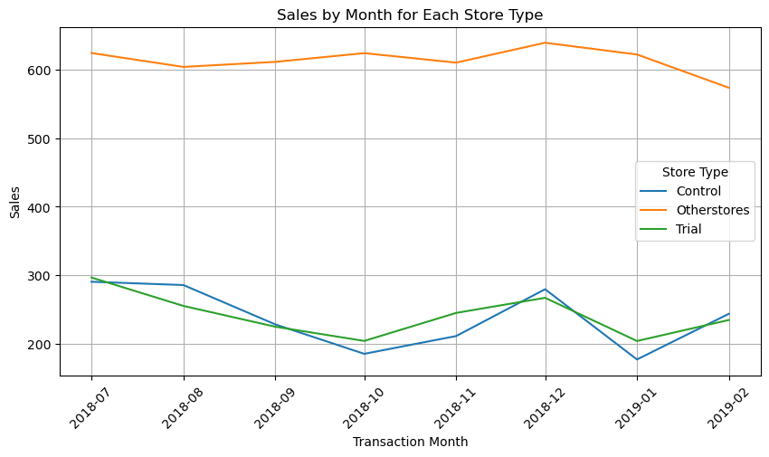
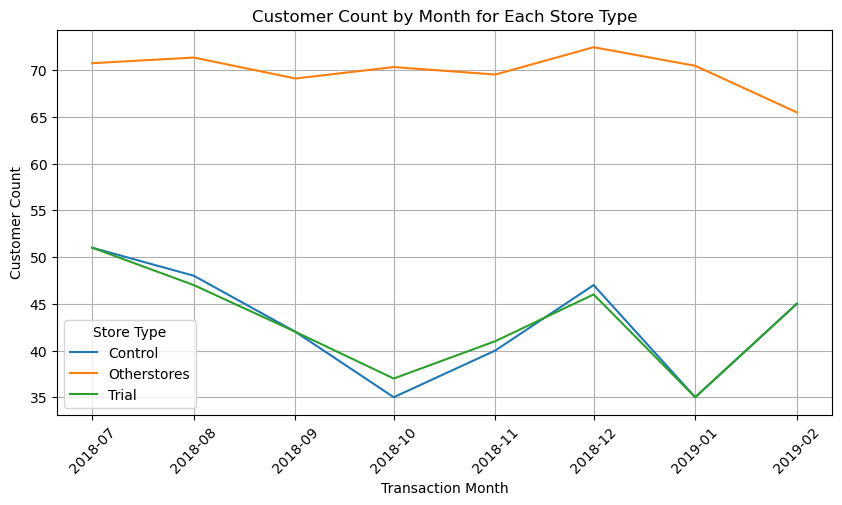
#### Trial Store 86
Store 155 is matched with trial store 86
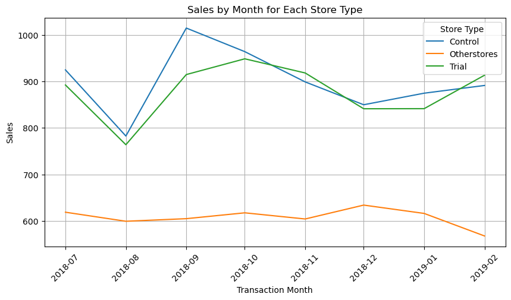
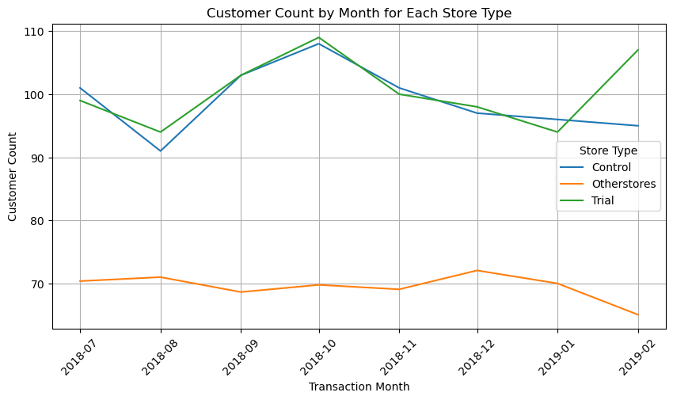
#### Trial Store 88
Store 237 is matched with trial store 88
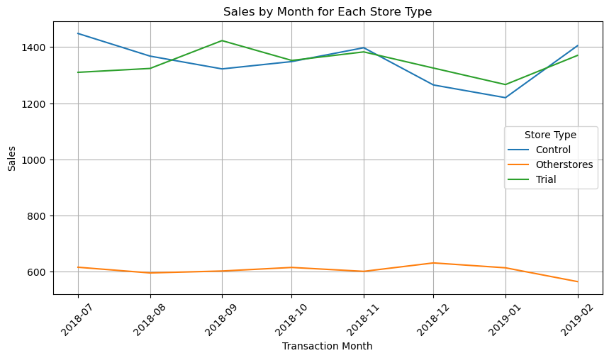
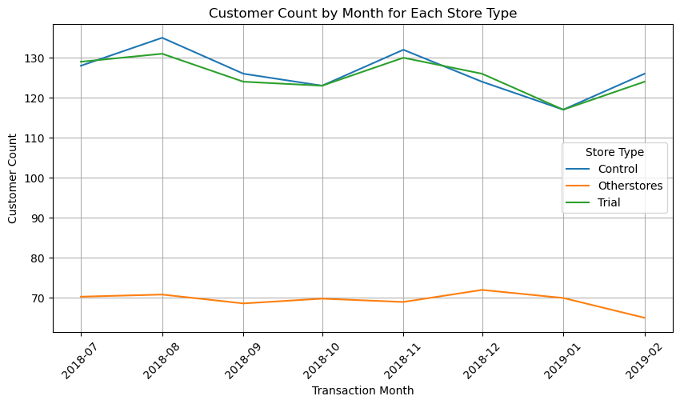

### Assessment for Uplift
The trial period ran from February 2019 to April 2019. We then analyzed whether the strategic changes resulted in an increase in sales or monthly customer count in the trial stores.

**Null Hypothesis (H₀):** Sales during the trial period are the same as sales or customer count during the pre-trial period.

#### t-test result
*The t-test was conducted with 7 degrees of freedom (df = 7). At a 95% confidence level, the t-critical value was 1.89.*
#### Trial Store 77 and Control Store 233

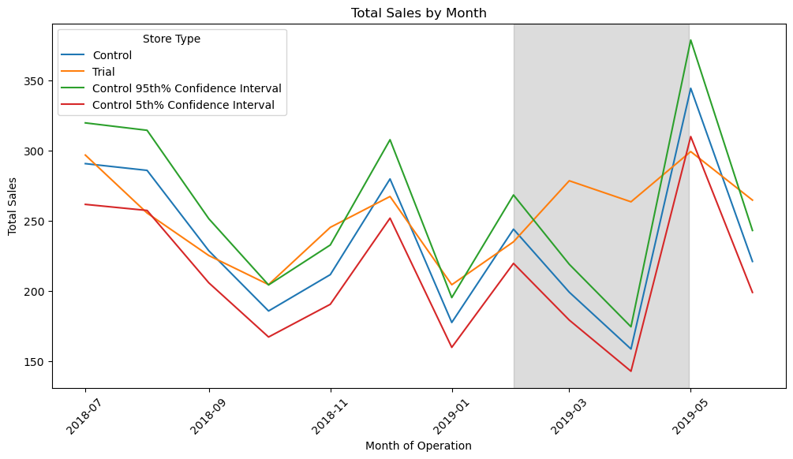  

- The t-test results indicate that the sales uplift in the trial store during March(7.33) and April(12.47) is statistically significant (t-values > 1.89), confirming that the difference is unlikely due to random fluctuations. 
- Additionally, the trial store’s performance falls outside the 5%-95% confidence interval of the control store in two of the three trial months, further validating the impact of the strategic changes.
  
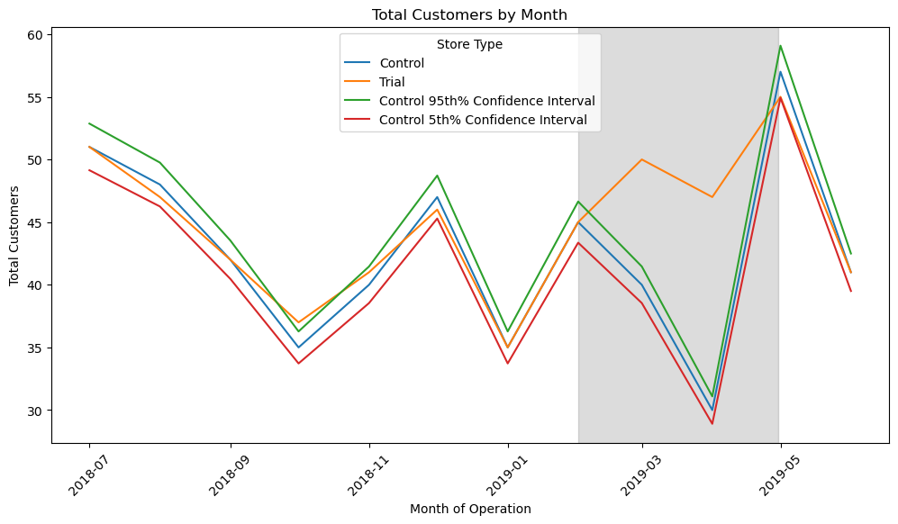

- The t-values for March (13.48) and April (30.78) are far above the critical threshold (1.89), confirming that the increase in customer count in the trial store is statistically significant and not due to random fluctuations.
- Before the trial period, customer trends in the trial and control stores were closely aligned within the 5%-95% confidence interval. During March and April, the trial store's customer count deviates noticeably above the confidence interval of the control store, further validating the effectiveness of the intervention.
#### Trial Store 86 and and Control Store 155
Store 155 is matched with trial store 86

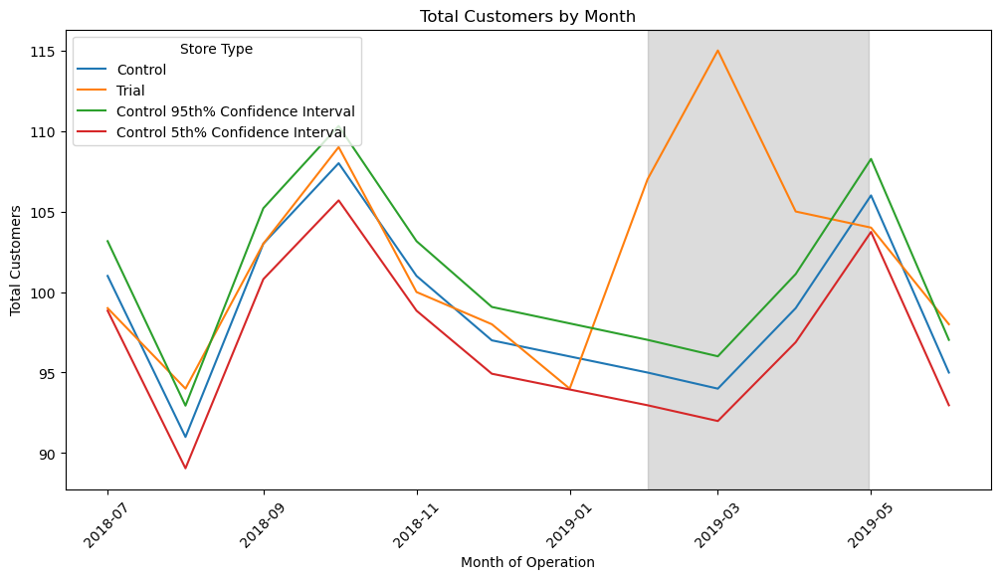

- The t-values for March (12.22) are far above the critical threshold (1.89), confirming that the increase in salesin the trial store is statistically significant and not due to random fluctuations.
- The trial store saw a significant sales surge in March, exceeding the control store’s 95% confidence interval, confirming a statistically significant impact. However, April’s sales dropped closer to the control store, suggesting the effect was not sustained.

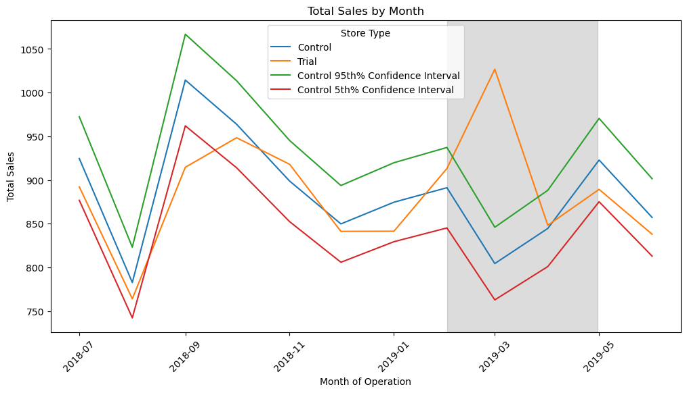

- The trial store attracted significantly more customers in all three months, as indicated by high t-values. However, sales were not consistently higher, suggesting potential price reductions or promotions. It's worth confirming with the Category Manager whether special deals influenced the results.
#### Trial Store 88 and Control Store 237
Store 237 is matched with trial store 88

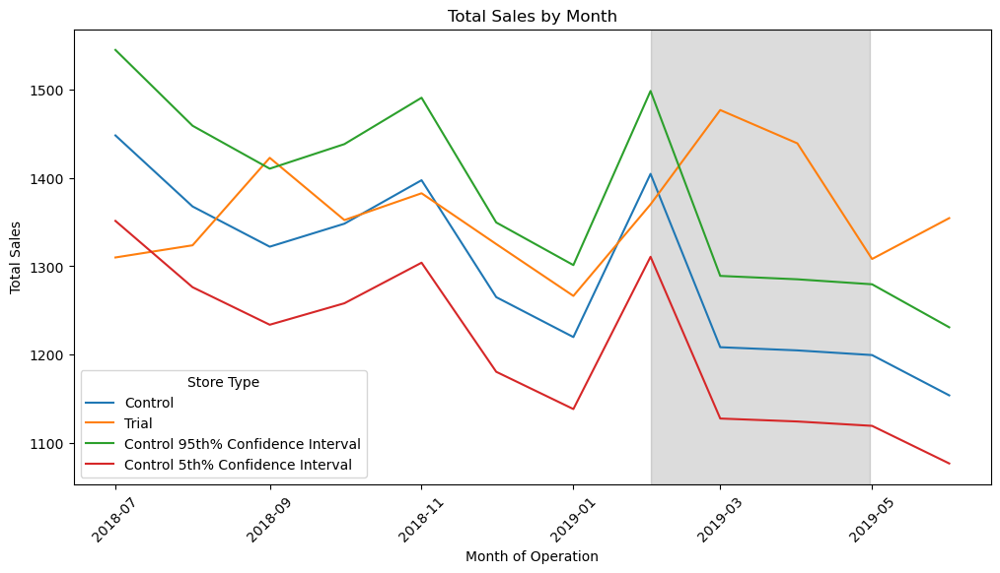

- The t-values for March (6.60) and April (5.77) are significantly larger than the critical value at the 95% confidence level, indicating that the increase in sales in the trial store during these months is statistically significant compared to the control store.
- The sales performance of the trial store in March and April is outside the control store’s 5% to 95% confidence interval range, reinforcing the statistical difference.
- The decline in April compared to March suggests that while the trial was effective, its impact may be tapering off.

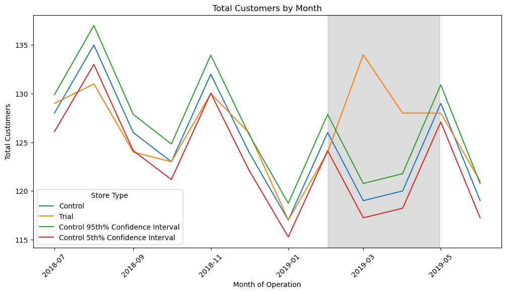

- The t-values for March (17.87) and April (9.81) are significantly larger than the critical value at the 95% confidence level, indicating that the increase in customer count in the trial store during these months is statistically significant compared to the control store.
- The customer count of the trial store in March and April is outside the control store’s 5% to 95% confidence interval range, reinforcing the statistical difference.
